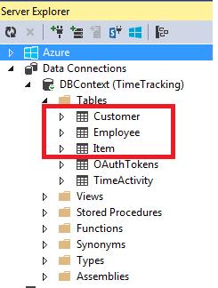
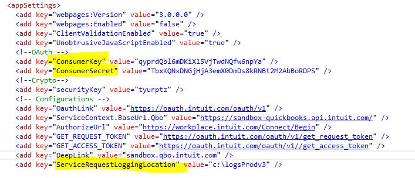
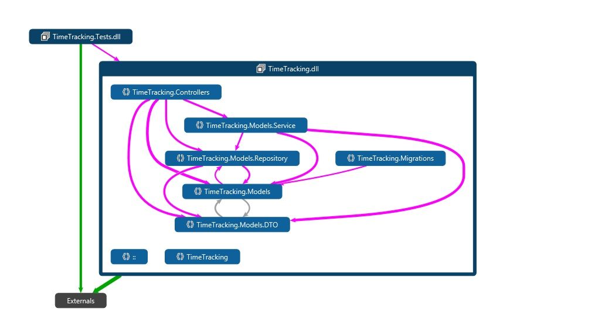

Time Tracking and Invoicing DotNet Sample App
=====================================

Welcome to the Intuit Developer's Time Tracking and Invoicing .NET Sample App.

This sample app is meant to provide working examples of how to integrate your app with the Intuit Small Business ecosystem.  Specifically, this sample application demonstrates the following:

<ul>
	<li>Implementing OAuth to connect an application to a customer's QuickBooks Online company.</li>
	<li>Syncing employee, customer, and service item data from the app's local database to the QuickBooks Online company.</li>
	<li>Using the QuickBooks Online SDK to create TimeActivity and Invoice objects in the QuickBooks Online company.</li>
</ul>

Please note that while these examples work, features not called out above are not intended to be taken and used in production business applications. In other words, this is not a seed project to be taken cart blanche and deployed to your production environment.
  

For example, certain concerns are not addressed at all in our samples (e.g. security, privacy, scalability). In our sample apps, we strive to strike a balance between clarity, maintainability, and performance where we can. However, clarity is ultimately the most important quality in a sample app.

Therefore there are certain instances where we might forgo a more complicated implementation (e.g. caching a frequently used value, robust error handling, more generic domain model structure) in favor of code that is easier to read. In that light, we welcome any feedback that makes our samples apps easier to learn from.

## Table of Contents

* [Requirements](#requirements)
* [First Use Instructions](#first-use-instructions)
* [Running the code](#running-the-code)
* [High Level Workflow](#high-level-workflow)
* [Project Structure](#project-structure)
* [How To Guides](#how-to-guides)
* [More Information](#more-information)

## Requirements

In order to successfully run this sample app you need a few things:

1. Visual Studio 2013
2. A [developer.intuit.com](http://developer.intuit.com) account
3. An app on [developer.intuit.com](http://developer.intuit.com) and the associated app token, consumer key, and consumer secret.
4. QuickBooks .NET SDK (already included in the project folder) 
 
## First Use Instructions

1. Clone the GitHub repo to your computer
2. Fill in your Configuration file values ( consumer key, consumer secret) by copying over from the keys section for your app.
3. Enable logging in the config file by updating the path.
4. Open the project from Visual Studio 
5. Populate the data in to tables from /Scripts folder

## Sync Tables

## Configuration

## Running the code

Once the sample app code is on your computer, you can do the following steps to run the app:

1. Hit F5 or > key</li>

## High Level Workflow
<ol>

<li>Connect to a QuickBooks Online company.

</li>

<li>Setup—sync the following from the local database to the QuickBooks Online company.
<ul>
  <li>employees—so time can be recorded against a specific service,</li>
  <li>customers—so time can be recorded as billable to a specific customer, </li>
  <li>items—the list of billable services.</li>
</ul>
</li>

<li>Create and push approved time activity objects to QuickBooks Online company for payroll and billing purposes.

</li>

<li>Create and push invoice objects to QuickBooks Online company for billing purposes.

</li>
</ol>

## Project Structure

## How To Guides

The following How-To guides related to implementation tasks necessary to produce a production-ready Intuit Partner Platform app (e.g. OAuth, OpenId, etc) are available:

* [OAuth How To Guide (DotNet)](Pending)

## Watch & Learn

Need to be implemented.

## More Information

More detailed information for this sample app can be found here [http://developer.intuit.com/v2/sampleapps/details/timetracking_details](http://developer.intuit.com/v2/sampleapps/details/timetracking_details).

    

